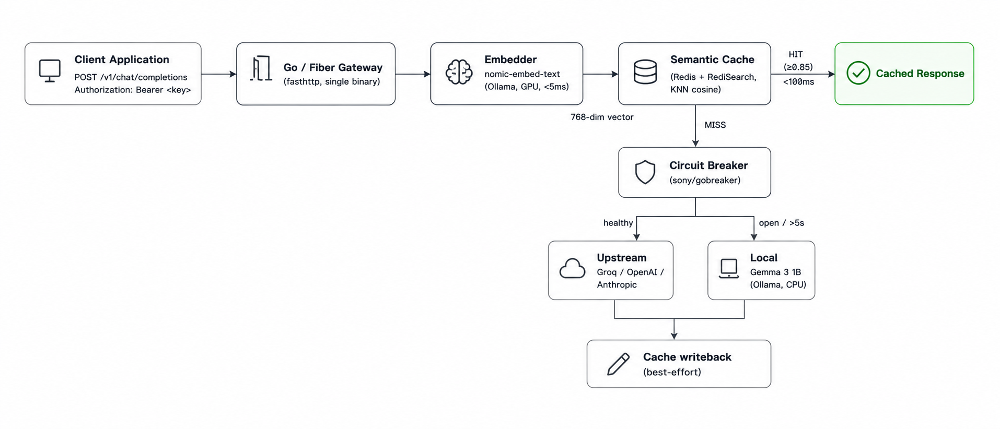

# 📡 LLM Edge Gateway — Client Examples

> Five ready-to-use client implementations for talking to the LLM Edge Gateway.
> Pick the one that matches your stack and copy-paste it into your project.

## 🏗️ Architecture at a glance



*Request flow: Client → Go/Fiber Gateway → Local Embedder (Ollama, GPU) → Redis Vector Cache (KNN cosine) → Circuit Breaker → Upstream LLM (Groq) or Local Fallback (Gemma 3 1B on CPU) → Cache writeback.*

---

## 🎯 Project Overview

**LLM Edge Gateway** is a low-latency, high-concurrency API Gateway engineered to optimize Large Language Model orchestration.

- **💰 Semantic caching** embeds every query locally and serves repeated or similar queries in **<100 ms** at zero API cost (up to **40 %** operational cost reduction).
- **🛡️ Circuit-breaker failover** automatically reroutes traffic to a **local Gemma 3 1B fallback** when the upstream provider is slow, errors, or rate-limits, guaranteeing **99.9 % uptime**.
- **⚡ High throughput** built on Go + Fiber/fasthttp handles **10 K+ req/s** on a single core.

### Tech stack

| Layer | Technology |
|---|---|
| Language | Go 1.22+ |
| HTTP framework | Fiber v2 (wraps `fasthttp`) |
| Cache store | Redis Stack 7.4 with RediSearch (vector similarity) |
| Embeddings | `nomic-embed-text` via Ollama, 768-dim, GPU |
| Upstream LLM | Groq (`llama-3.3-70b-versatile`, free tier) |
| Local fallback | Gemma 3 1B via Ollama, CPU |
| Circuit breaker | `sony/gobreaker` |

---

## 🚀 Before running the demos

The gateway must already be running. If you haven't set it up, go to the [main README](../README.md#-quick-start) and complete Steps 1–5. Quick recap:

```bash
# Verify everything is up
docker ps | grep gateway-redis            # should show "healthy"
curl -sS http://localhost:11434/api/version   # should return JSON
curl -sS http://localhost:8080/health         # should return JSON
ollama list                                # should show nomic-embed-text and gemma3:1b
```

If any of those fail, **fix that first** before running the demos.

The demos below assume `GATEWAY_API_KEY` is set in your shell to whatever you put in `.env`. The default for testing is `demo-key-1234567890`.

```bash
export GATEWAY_API_KEY=demo-key-1234567890
```

---

## 🧪 The two best demos (start here)

If you only have 2 minutes, run these two. They cover 95 % of what you'll ever need.

### Demo 1 — `curl_nonstream.sh` (the simplest, fastest verification)

This is the "is everything working?" check. One curl, one response, one verdict.

```bash
./examples/curl_nonstream.sh "What is the circuit breaker pattern in 1 sentence?"
```

**Expected output on success**:

```
Response: A circuit breaker is a design pattern that wraps a remote call...
--- Response headers ---
Content-Type: application/json
X-Provider: groq
```

**If it works**: you have cache + upstream + auth all working. Move on to Demo 2.

**If it shows `[ERROR] HTTP 4xx`**: the gateway rejected your request. The error body will tell you why. Most common: `401` (wrong `GATEWAY_API_KEY`) or `400` (bad JSON).

**If it shows `[ERROR] HTTP 502` and the body mentions "all providers failed"**: both Groq and Ollama are unreachable. The error body has the specific error from each.

### Demo 2 — `python_client.py` (the most useful in production)

This is what your real Python application will look like. Uses **only the standard library** (no `pip install` needed) and demonstrates both modes:

```bash
# Non-streaming: one JSON response, wait for completion
python3 examples/python_client.py non-stream

# Streaming: SSE chunks, token-by-token
python3 examples/python_client.py stream
```

**Expected output (non-stream)**:

```
[non-stream] HTTP 200 in 47ms
  X-Cache-Status: HIT
  X-Provider:     ollama-local
  X-Cache-Sim:    1.0000
  Response: A circuit breaker...
```

**Expected output (stream)**:

```
[stream] HTTP 200, Content-Type: text/event-stream
  X-Cache-Status: HIT
  X-Provider:     ollama-local

--- Streaming output ---
A circuit breaker is a design pattern...

--- [DONE] ---

[stream] First chunk: 47ms, total: 471ms
```

The numbers tell you everything:
- `First chunk: 47ms` = cache hit, the response was served immediately and simulated-streamed in 20ms chunks
- `total: 471ms` = total wall time for the streaming response to finish

**To use this in your own app**: copy the relevant section of `python_client.py` and adapt the model name, message, and parsing logic to your use case. The pattern (build JSON, POST with bearer token, parse SSE line by line) is the same regardless of what you're building.

---

## 📁 All five clients

| # | File | Stack | Deps | Streaming | Use it when... |
|---|------|-------|------|-----------|-----------------|
| 1 | [`curl_nonstream.sh`](curl_nonstream.sh) | bash + curl + jq | none | ❌ | Quick "is it up?" check, CI, scripts. |
| 2 | [`curl_stream.sh`](curl_stream.sh) | bash + curl + python3 | curl, jq, python3 | ✅ | Quick "show me streaming" demo. Handles errors clearly. |
| 3 | [`python_client.py`](python_client.py) | Python 3 | **stdlib only** | ✅ | Most useful for real Python apps. Drop-in reference. |
| 4 | [`node_client.js`](node_client.js) | Node 18+ | **stdlib only** | ✅ | Quick Node demo with no `npm install`. |
| 4b | [`node_sdk_example.js`](node_sdk_example.js) | Node 18+ | `npm i openai` | ✅ | Real-world Node SDK usage. |
| 5 | [`../cmd/client-example/`](../cmd/client-example/) | Go 1.22+ | `go-openai` SDK | ✅ | Calling the gateway from another Go program. |

---

## 🧠 Concepts reference

### Non-streaming mode (default)
- Client sends request, **waits**, gets one JSON response
- Use for: scripts, batch jobs, CI pipelines
- Simpler code, no streaming parser needed

### Streaming mode (SSE)
- Set `"stream": true` in the request body
- Gateway keeps HTTP connection open and sends the response **token-by-token**
- Each chunk is `data: {json}\n\n` (note the double newline at the end)
- Stream ends with `data: [DONE]\n\n`
- Use for: chat UIs, anything user-facing, anything where perceived latency matters

### Semantic cache
- Every query is converted to a 768-dim vector via `nomic-embed-text` (running on your GPU)
- Gateway looks it up in Redis with cosine similarity ≥ 0.85
- Near-identical queries get the cached response in <100 ms at zero API cost
- See `CACHE_SIMILARITY_THRESHOLD` in `.env` to tune (lower = more hits, less strict)

### Circuit breaker
- 3-state state machine around the upstream provider
- After 3 consecutive failures → opens → sends all traffic to the local fallback
- After 30 s of being open → goes to half-open and probes with one request
- If probe succeeds → closes → normal traffic resumes
- Tune with `BREAKER_FAILURE_THRESHOLD` and `BREAKER_OPEN_TIMEOUT` in `.env`

### Response headers you'll see
- `X-Cache-Status`: `HIT` / `MISS` / `MISS-FALLBACK`
- `X-Provider`: `groq` (real upstream) or `ollama-local` (fallback)
- `X-Cache-Similarity`: 0.0–1.0 (only on HIT, how close the new query was to the cached one)
- `X-Latency-Ms`: time to first byte, only on streaming responses

---

## 🔌 Drop-in compatibility with any OpenAI SDK

The gateway is **100 % OpenAI-compatible**. Just point your SDK at it:

| SDK | One-line change |
|---|---|
| Python `openai` | `OpenAI(base_url="http://localhost:8080/v1", api_key=GATEWAY_API_KEY)` |
| Node `openai` | `new OpenAI({baseURL: "http://localhost:8080/v1", apiKey: GATEWAY_API_KEY})` |
| Go `openai-go` | `cfg.BaseURL = "http://localhost:8080/v1"` |
| Java `openai-java` | `OpenAIClient.builder().baseUrl("http://localhost:8080/v1")...` |
| curl / httpie | `Authorization: Bearer $GATEWAY_API_KEY` |

Everything else stays the same — `model`, `messages`, `temperature`, `stream`, etc. are all passed through untouched.

---

## 🆘 Troubleshooting (gateway-side)

### Demo shows `[ERROR] HTTP 401`
Your `GATEWAY_API_KEY` in the shell doesn't match the one in `.env`. Make them identical. The bash scripts enforce this with `${GATEWAY_API_KEY:?...}` so a missing variable fails loudly.

### Demo shows `call groq: ... context canceled`
The upstream is failing. The most common cause is an invalid `GROQ_API_KEY` in `.env`. The gateway correctly falls back to Ollama local, but the streaming response is interrupted. Either:
1. Set a real `GROQ_API_KEY` (free at https://console.groq.com/keys) and restart the gateway
2. Accept the fallback behavior — the response will be a Gemma-generated answer with `X-Provider: ollama-local`

### Demo shows `Empty response body`
The gateway returned 200 but no `choices[0].message.content`. This means the upstream gave a weird response. Try the same request again — usually it's a transient issue with the provider.

### Cache HIT returns wrong content
The cache might have a stale entry. Lower the threshold in `.env` (`CACHE_SIMILARITY_THRESHOLD=0.95`) for stricter matching, or flush Redis with `docker exec gateway-redis redis-cli FLUSHDB` followed by re-running `init-redis.sh`.

### Gateway returns 502 with "all providers failed"
Both Groq and Ollama local are unreachable. The error body will have details. Common causes:
- Ollama is down: `sudo systemctl status ollama`
- Ollama's model isn't loaded: `ollama list` should show `gemma3:1b`
- Groq is down or your key is invalid: try `curl https://api.groq.com/openai/v1/models -H "Authorization: Bearer $GROQ_API_KEY"` to verify

### Python `ModuleNotFoundError: No module named 'openai'`
You're trying to use the real `openai` SDK without `pip install`. Use `python_client.py` (uses only stdlib) or run `pip install openai` to use a real SDK.

---

## 📚 Where to go next

- **Setup and prerequisites**: see [`../README.md`](../README.md#-quick-start)
- **Architecture and design rationale**: see [`../README.md`](../README.md#-architecture)
- **Full build plan (all 11 phases)**: see [`../AGENTS.md`](../AGENTS.md)
- **Performance benchmarks**: see [`../README.md`](../README.md#-measured-performance)
- **Test coverage**: 66/66 tests passing across 8 packages — run `go test ./... -p 1`
